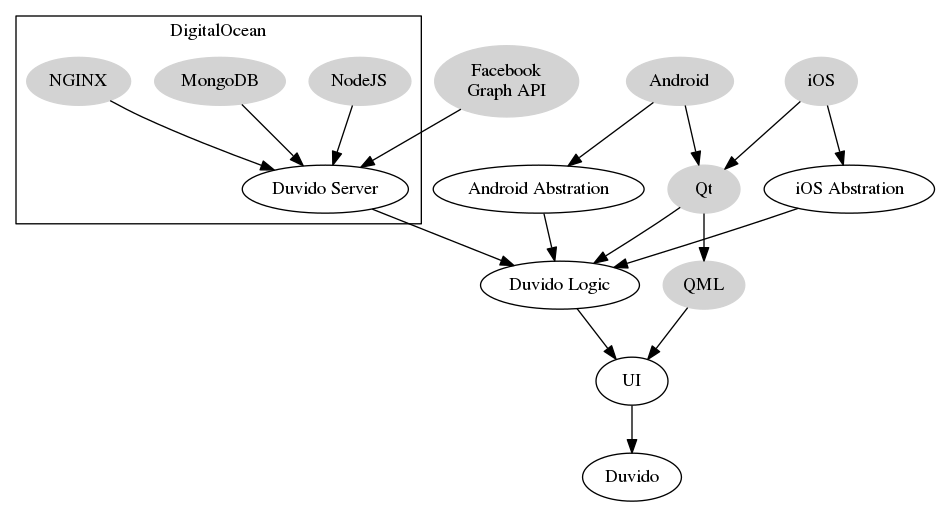

# Dependencies

 - Android SDK
 - Android NDK
 - Qt 5.4+
 - For generating the java interface only (java2cpp):
     - Ruby 1.9+
     - Parslet (`sudo gem install parslet`)

# Building Process

Simply open project on Qt Creator and build it (or use `qmake` if you are brave enough).

For generating the java interface use this command:

    cd java && ./java2cpp.rb

# Upstream bugs affecting this app:

- Flickable speed: https://bugreports.qt.io/browse/QTBUG-35608
    - Seems like a fix is on the way for Qt 5.5
